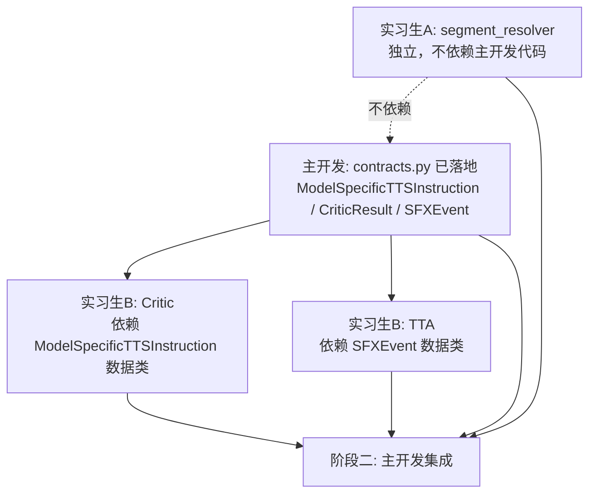

# short_book_agent 优化方案（修订版）：借鉴 Audio-Oscar 改造

> 基于 Audio-Oscar（arXiv:2606.07397）多 Agent 音频生成框架的设计思路，对 `short_audiobook_agent/src_next/` 进行架构优化。
> 本文档是团队分工与执行的总纲，配合 `intern_a_*.md` / `intern_b_*.md` 两份任务卡使用。

---

## 0. 本次修订相对原方案的变化

| 变化点 | 原方案 | 本次修订 | 原因 |
|---|---|---|---|
| Stage 编号 | 出现 6.5 / 7.5 等小数 stage | 整数编号 + 并行用图示 | 实习生按编号沟通时不混淆 |
| 模型 configs | 只列 cosyvoice3 / indextts / qwen3tts / voxcpm2 | 加 **S2Pro**（已实装，需纳入新架构） | 上周 S2Pro adapter 已落地，是迁移到新架构的关键 case |
| TTA 后端 | MeanAudio / MMAudio / StableAudio 三选一 | **仅 MOSSSoundEffect**（服务器现状） | 黄区服务器目前只有这一个 TTA 服务可用 |
| Qwen3-Omni | 假设性服务（地址待定） | **已部署**：`http://10.50.121.102:8011`，单请求锁 | 服务已就绪，但有 infer_lock 并发限制 |
| 数据契约文件 | `core/contracts.py`（独立新文件） | **直接扩展 `core/data_models.py`** | 项目已有集中数据契约文件，无需双轨 |
| 接口落地 | 待阶段一开工前起草 | **本次提交已落地** `data_models.py` 末尾 3 个 dataclass | 主开发今天就完成，实习生开工即用 |

---

## 1. 背景与动机

当前 `src_next/` 是一个 10 阶段线性 pipeline，核心问题：

1. **信息损失链**：`DirectorInstruction`（11 个通用语义字段）→ `tts_instruction_builder`（clamp + whitelist）→ `TTSInstruction`（仍为通用）→ adapter 内部映射 → HTTP 请求。每一步映射都丢失信息，LLM 生成的丰富表演指令被层层削减。
2. **规则化文本处理**：分段、引语分类、说话人识别全靠规则，缺乏语义理解，边界 case 多。
3. **无质量闭环**：TTS 合成后直接输出，没有评估-修复机制，无法保证音频质量。
4. **缺少音效层**：纯语音输出，缺少环境音和情绪音效，沉浸感不足。

Audio-Oscar 的核心思路：
- **Agent = LLM + Prompt + 输出格式约束**，不同 Agent 通过不同的 prompt 和上游数据合并逻辑实现分工。
- **LLM 直接看到模型能力描述**，输出模型特定参数，消除中间映射层。
- **Critic 闭环**：多模态模型（Qwen3-Omni）听音频评分 → 修复指令 → 重新生成。
- **音效规划与语音生成并行**，最终多轨混合。

---

## 2. 改造方向总览

| 优先级 | 方向 | 价值 | 复杂度 | 负责人 | 接口契约（data_models.py） |
|---|---|---|---|---|---|
| **P0** | 方向1：Agent 直接输出模型特定 TTS 参数 | 极高 | 中 | 主开发 | `ModelSpecificTTSInstruction` |
| **P0** | 补充5：Prompt 与模型能力描述分离 | 高 | 低 | 主开发（随方向1一起做） | — |
| **P1** | 方向3：Critic 评估-修复机制 | 极高 | 中-高 | 实习生B | `CriticResult` |
| **P2** | 方向2：Agent 化文本处理 | 中 | 低 | 实习生A | 复用 `Segment` |
| **P2** | 方向4一期：段落间环境音效 | 中-高 | 中 | 实习生B | `SFXEvent` |

**实施顺序**：补充5 + 方向1（合并做）→ 方向2 → 方向3 → 方向4一期

---

## 3. 改造后的完整 Pipeline 架构

### 3.1 新链路 stage 编号（最终态，所有功能开启）

```
Stage 1: build_segments             （规则分段，保留）
Stage 2: create_llm_client          （保留）
Stage 3: segment_resolver           （合并原 Stage 3+4，Agent 化）       [实习生A]
Stage 4: character_analyzer         （保留）
Stage 5: voicebank                  （保留）
Stage 6: tts_director               （合并原 Stage 7+8，输出模型特定参数）[主开发]
Stage 7: 并行 { tts_synthesis + sfx_generation }                         [sfx: 实习生B]
Stage 8: critic_evaluate_and_repair                                      [实习生B]
Stage 9: audio_merger               （支持段间音效插入）                  [实习生B 改 merger]
```

### 3.2 并行关系图（Stage 7 内部）

```mermaid
graph LR
    A[Stage 6 输出<br/>ModelSpecificTTSInstruction[]<br/>+ SFXEvent[]] --> B[Stage 7a: tts_synthesis]
    A --> C[Stage 7b: sfx_generation]
    B --> D[Stage 8: critic loop<br/>仅评估语音段]
    C --> E[音效 wav 落盘<br/>等 Stage 8 完成]
    D --> F[Stage 9: audio_merger<br/>段间插 SFXEvent.audio_path]
    E --> F
```

**关键点**：
- Stage 7a 和 Stage 7b 共享上游产物（tts_director 同时输出 TTS 指令和 SFX 事件描述），所以 Stage 6 必须先把两者都生成完。
- Stage 8 的 Critic 循环**只针对语音段**——音效质量评估留二期。
- Stage 9 等待 7a（修复后）+ 7b 都完成才合并。

### 3.3 开关化设计（所有新功能默认关闭）

```yaml
pipeline:
  use_agent_resolver: false    # 方向2：true 时 Stage 3 用 Agent 替代规则分类+识别
  enable_critic: false         # 方向3：true 时启用 Stage 8 评估-修复循环
  enable_sfx: false            # 方向4：true 时启用 Stage 7b + Stage 9 音效插入
  critic_max_retries: 2
  critic_threshold: 0.7
```

未开启任何开关时，pipeline 行为与当前 main 分支完全一致（10 stage 不变）。这是为了确保改造期间 main 始终可用。

---

## 4. 方向1（主开发）：Agent 直接输出模型特定 TTS 参数

### 4.1 信息流对比

**原链路（信息损失）**：
```
story_director (LLM)
  → DirectorInstruction {emotion, pace, tone, volume, pitch, ...}
    → tts_instruction_builder (clamp + whitelist)
      → TTSInstruction {仍是通用字段}
        → adapter 内部映射
          → HTTP 请求 {模型特定参数}
```

**新链路（直接透传）**：
```
tts_director (LLM, prompt 注入模型能力描述)
  → ModelSpecificTTSInstruction {model: "S2Pro", parameters: {...}}
    → adapter 直接透传 parameters
      → HTTP 请求
```

### 4.2 实施步骤

**Step 1**：新建模型能力描述目录

```
src_next/tts/model_configs/
  cosyvoice3.json       # CosyVoice3：instruct_text + speed
  s2pro.json            # S2Pro：instruction + inline_tags + reference_audio
  indextts2.json        # IndexTTS-2：emotion_vector + prompt_text
  qwen3tts.json         # Qwen3-TTS：voice description 自然语言
  mosssoundeffect.json  # （方向4用）TTA 音效模型
```

每份 JSON 包含：模型名 / 描述 / 参数 schema（字段名 + 类型 + 默认值 + 用途说明）。

**S2Pro 的 model_configs 示例**（重点：迁移当前 adapter 的标签逻辑到 LLM prompt）：

```json
{
  "name": "S2Pro",
  "description": "Fish Audio S2-Pro 4B。支持音色克隆（reference_audio）+ 全局 instruction（中文自由文本）+ 15000+ 内联标签（[excited] / [pause] / [emphasis] 等）。",
  "parameters": {
    "instruction": {
      "type": "string",
      "description": "全局风格指令，中文自由文本。如 '以低沉缓慢的语气叙述，传递感伤和沉重'。",
      "default": ""
    },
    "inline_tags_text": {
      "type": "string",
      "description": "把内联标签直接嵌入文本，如 '[sad][speak slowly]望着远方[pause]'。标签语法参考 usage_guide_s2pro.md 第 7 节。",
      "default": ""
    },
    "enable_reference_audio": {
      "type": "bool",
      "description": "是否启用音色克隆。true 时必须传 voice_ref。",
      "default": true
    },
    "temperature": {"type": "float", "default": 0.7},
    "top_p": {"type": "float", "default": 0.7}
  }
}
```

**Step 2**：新建 `analysis/tts_director.py`

合并原 `story_director.py` + `core/tts_instruction_builder.py` 的职责。LLM 直接看到 `model_configs/*.json` 的能力描述，为每个 segment 输出 `ModelSpecificTTSInstruction`。

```python
class TTSDirectorAgent:
    def __init__(self, llm_client: BaseLLMClient, model_configs: list[dict]):
        self.llm = llm_client
        self.model_configs = model_configs

    def direct(
        self,
        segments: list[Segment],
        character_profiles: list[CharacterProfile],
        voicebank_result: VoicebankResult,
    ) -> list[ModelSpecificTTSInstruction]:
        system_prompt = TTS_DIRECTOR_SYSTEM_PROMPT.format(
            available_models=json.dumps(self.model_configs, ensure_ascii=False, indent=2)
        )
        user_prompt = self._build_user_prompt(segments, character_profiles, voicebank_result)
        response = self.llm.generate_json(system_prompt, user_prompt)
        return self._parse_response(response, segments)
```

**Step 3**：adapter 简化为参数透传

```python
# 改造前：adapter 内部做 emotion → [sad] 的映射
# 改造后：LLM 已直接输出 [sad]，adapter 只透传
def synthesize(self, instruction: ModelSpecificTTSInstruction) -> AudioSegmentResult:
    params = dict(instruction.parameters)
    params["text"] = instruction.text
    if instruction.voice_ref:
        params["reference_audio"] = instruction.voice_ref
    wav_bytes = self._call_http(params)
    ...
```

**Step 4**：Stage 编号调整（合并 7+8 → 新 6）

| 旧 stage | 新 stage | 备注 |
|---|---|---|
| 7 story_director | 6 tts_director | 与原 stage 8 合并 |
| 8 tts_instruction_builder | （删除） | 职责并入 tts_director |
| 9 tts_synthesis | 7a tts_synthesis | adapter 接口变了 |
| 10 audio_merger | 9 audio_merger | 编号顺移 |

### 4.3 涉及文件

| 操作 | 文件 |
|---|---|
| 新增 | `src_next/tts/model_configs/cosyvoice3.json` |
| 新增 | `src_next/tts/model_configs/s2pro.json` |
| 新增 | `src_next/tts/model_configs/indextts2.json` |
| 新增 | `src_next/tts/model_configs/qwen3tts.json` |
| 新增 | `src_next/tts/model_configs/mosssoundeffect.json`（方向4共用） |
| 新增 | `src_next/analysis/tts_director.py` |
| 新增 | `src_next/analysis/prompts/tts_director_prompt.py` |
| 修改 | `src_next/tts/s2pro_adapter.py`（简化为透传） |
| 修改 | `src_next/tts/cosyvoice_http.py`（简化为透传） |
| 修改 | `src_next/tts/indextts_http.py`（简化为透传） |
| 修改 | `src_next/core/audiobook_pipeline.py`（Stage 6-7 调用切换） |
| 保留 | `src_next/analysis/story_director.py`（开关关闭时回退到老链路） |
| 保留 | `src_next/core/tts_instruction_builder.py`（同上） |

---

## 5. 方向2（实习生A）：Agent 化文本处理

详细任务卡见 `intern_a_segment_resolver.md`。

**核心**：合并原 Stage 3（quote_classifier）+ Stage 4（story_resolver）为单个 Agent 调用。

**关键边界**：
- **不改 `segment_builder.py`**：规则分段骨架保留，比 LLM 更可靠。
- **1:1 输入输出**：segment_resolver 不允许改变 segment 数量（与原 quote_classifier 的 N→M 不同）。原 quote_classifier 允许把"非对白引号"并回 narration（N→M），新 Agent 设计时把这一步前置到 segment_builder 或保留并回逻辑，详见任务卡。
- **segment_type 枚举**：`narration` / `dialogue` / `inner_thought`（与现有 Segment 定义一致）。

---

## 6. 方向3（实习生B）：Critic 评估-修复机制

详细任务卡见 `intern_b_critic_and_tta.md`。

**核心**：用 Qwen3-Omni 多模态模型听音频 → 5 维评分 → 修复指令 → 重合成。

**关键边界**：
- **服务已就绪**：`http://10.50.121.102:8011`，详见 `ussage_guide_qwen3_omni.md`。
- **infer_lock 限制**：服务同一时间只处理一个请求，Critic 调用必须**串行**，不可并发。
- **使用 `/v1/omni/audio_analysis`** 端点（`task: "sound_analysis"` 或自定义 prompt），不需要 base64（音频文件传服务器路径即可）。
- **5 维评分**：quality / emotion_alignment / character_consistency / rhythm_naturalness / intelligibility（详见 `data_models.py:CriticResult`）。
- **Repair 策略**：**只调参数**，不改原文 text，不换模型（避免声音不一致）。

---

## 7. 方向4（实习生B）：段落间环境音效（一期）

详细任务卡见 `intern_b_critic_and_tta.md`。

**核心**：用 TTA 生成段间环境音，替代当前的静默间隔。

**关键边界**：
- **服务器现状**：黄区仅有 `MOSSSoundEffect` 一个 TTA 服务可用。一期不做多模型选择，`SFXEvent.model` 固定为 `"MOSSSoundEffect"`。
- **TTA 服务地址**：需要实习生B 与服务器运维确认（当前 `usage_guide_moss_voicegen.md` 文档的是 MOSS-VoiceGenerator 即 TTS，不是 TTA；MOSSSoundEffect 的端点 / 参数 schema 待补）。
- **一期不做叠加**：音效在段间拼接，不与语音多轨混合。
- **二期预留**：`SFXEvent.position` 字段已设计为支持 `"in_seg_xxx_at_<sec>"`，但 audio_merger 一期不实现叠加。

---

## 8. 团队分工与协作

### 8.1 人员与方向分配

| 角色 | 负责方向 | 主要产出 |
|---|---|---|
| **主开发** | 补充5 + 方向1 + pipeline 集成 | `model_configs/*.json` + `tts_director.py` + adapter 改造 + Stage 6-7 切换 |
| **实习生A** | 方向2 | `analysis/segment_resolver.py` + prompt + 单元测试黄金集 |
| **实习生B** | 方向3 + 方向4 | `critic/` 目录 + `tta/` 目录 + `sfx_planner.py` + audio_merger 改造 |

### 8.2 依赖关系



**关键**：实习生B 写 Critic / TTA 时，**只需要从 `core.data_models` 导入数据类**，不需要主开发的 `tts_director.py` 跑通。验收用 mock 数据，不依赖 pipeline。

### 8.3 两阶段协作策略

#### 阶段一：组件开发（并行，约 1-2 周）

**核心原则：每个人只写新文件 / 新目录。`audiobook_pipeline.py` 任何人都不改。**

| 角色 | 可写区域 | 禁止改动 |
|---|---|---|
| 主开发 | `tts/model_configs/*.json` + `analysis/tts_director.py` + `analysis/prompts/tts_director_prompt.py` + `tts/*_adapter.py`（改造现有） | 暂不动 `audiobook_pipeline.py` |
| 实习生A | `analysis/segment_resolver.py` + `analysis/prompts/segment_resolver_prompt.py` + 单元测试 | 不改 `segment_builder.py` / `quote_classifier.py` / `story_resolver.py` / `audiobook_pipeline.py` |
| 实习生B | `critic/*` + `tta/*` + `analysis/sfx_planner.py` + `analysis/prompts/sfx_planner_prompt.py` + 单元测试 | 不改 `audiobook_pipeline.py` / `data_models.py` / `tts/*_adapter.py` |

#### 阶段二：集成（串行，约 1 周，主开发执行）

```
1. 合入方向1（主开发自己）→ 跑通新主干流程（开关关闭时回退老链路）
2. 合入方向2 → 替换 Stage 3 调用（开关 use_agent_resolver）
3. 合入方向3 → 插入 Stage 8 Critic 循环（开关 enable_critic）
4. 合入方向4 → 插入 Stage 7b + Stage 9 音效（开关 enable_sfx）
5. 端到端测试 + 性能基线
```

每集成一个方向跑一次端到端，确保增量改动不破坏已有功能。

### 8.4 阶段一验收方式

**不通过跑 pipeline 验收**（pipeline 还没接入），靠**单元测试 + integration 测试**：

**测试分两类，都要写**：
- **功能测试**：用真实 LLM / 真实 Qwen3-Omni / 真实 TTA 服务，验证 prompt 设计和接口正确性。标记 `@pytest.mark.integration`，PR 合并前必跑。
- **Robustness 测试**：mock 服务异常（500 / 非 JSON / 缺字段），验证 fallback 路径不崩。CI fast 模式必跑。

各人分工：

- **实习生A**：`segment_resolver` 12 case 黄金集——10 个功能 case 用真 LLM（Gemma4 HTTP via profile），2 个 robustness case 用 mock LLM。
- **实习生B**：
  - Critic 功能测试用真 Qwen3-Omni（必须串行，infer_lock 限制），robustness 用 mock HTTP。
  - Repair 功能测试用真 LLM（验证 LLM 不乱改 segment_id / text 等字段），robustness 用 mock。
  - TTA 功能测试：MOSSSoundEffect 已就绪则真实调用，未就绪则 `pytest.skip` 但代码骨架必须写好。
  - SFX Planner 功能测试用真 LLM（验证 description 是英文、position 格式合法）。
- **主开发**：`tts_director` 功能测试用真 LLM（验证输出的 parameters schema 合法）；adapter 透传测试 mock HTTP。

### 8.5 分支策略

```
main
  ├── feature/model-configs-and-tts-director   (主开发)
  ├── feature/segment-resolver                 (实习生A)
  └── feature/critic-and-tta                   (实习生B)
```

合并顺序（阶段二）：
1. `feature/model-configs-and-tts-director` 先合入 main（数据模型是基础）
2. 实习生A rebase main → 合入 `feature/segment-resolver`
3. 实习生B rebase main → 合入 `feature/critic-and-tta`

---

## 9. 实习生必须遵守的规则

| 规则 | 原因 |
|---|---|
| 不改 `core/audiobook_pipeline.py` | 避免三人同时改同一文件的冲突 |
| 不改 `core/data_models.py`（只读导入） | 数据类已由主开发统一定义 |
| 不改 `tts/*_adapter.py` | adapter 改造属于方向1，由主开发负责 |
| 不改 `analysis/story_director.py` / `core/tts_instruction_builder.py` | 老链路保留作为 fallback |
| 只写自己目录下的新文件 | 确保阶段一零冲突 |
| **PR 必须含功能测试（真实服务）+ robustness 测试（mock）** | 功能测试验证 prompt 设计有效，robustness 验证故障不崩；两者缺一不可 |
| **integration 测试用 `@pytest.mark.integration` 标记** | CI fast 模式可跳过慢测试，PR 合并前手动跑 |
| 数据类从 `core.data_models` 导入 | 不自己定义重复的数据类 |

---

## 10. 服务依赖现状

| 服务 | 地址 | 状态 | 用途 |
|---|---|---|---|
| Gemma4 LLM | `http://10.50.121.123:8000` | 已部署 | 主链路 LLM |
| Qwen3 VoiceDesign | `http://10.50.121.102:8007` | 已部署 | voicebank |
| S2Pro TTS | `http://10.50.121.102:8010` | 已部署 | TTS（含音色克隆） |
| CosyVoice TTS | （黄区现有） | 已部署 | TTS |
| IndexTTS TTS | （黄区现有） | 已部署 | TTS |
| **Qwen3-Omni** | `http://10.50.121.102:8011` | **已部署** | Critic 评估（方向3） |
| **MOSSSoundEffect TTA** | 地址待实习生B 与运维确认 | **待确认端点** | 段间音效（方向4） |

**Qwen3-Omni 关键约束**：
- 服务使用 `infer_lock`，**同一时间只处理一个请求**——Critic 调用必须串行。
- 推荐用 `/v1/omni/audio_analysis`（`task: "sound_analysis"`）端点，音频文件传**服务器可读路径**（无需 base64）。
- 详见 `ussage_guide_qwen3_omni.md`。

---

## 11. Oscar 参考文件索引

| 改造方向 | Oscar 参考文件 | 参考内容 |
|---|---|---|
| 方向1 | `agents/speech_generator.py` | LLM 直接输出模型+参数的模式 |
| 方向1 | `tts/tts_config.json` | 模型能力描述 JSON 格式 |
| 方向2 | `agents/speech_planner.py` | 单 Agent 完成分段+识别的模式 |
| 方向3 | `agents/audio_critic.py` | Qwen3-Omni 听音频评分的实现 |
| 方向3 | `executor/tta_quality_loop.py` | 评估-修复循环的完整逻辑 |
| 方向4 | `agents/audio_planner.py` | 音效规划 Agent 的 scope 约束 |

---

## 12. 风险与待确认

1. **MOSSSoundEffect 服务端点未知**：当前文档（`usage_guide_moss_voicegen.md`）描述的是 MOSS-VoiceGenerator（TTS），不是 TTA。实习生B 开工前需与运维确认 TTA 服务的端点、参数 schema、采样率。
2. **Critic 阈值需要调参**：默认 `threshold=0.7, overall_floor=0.75` 是参考值，实际可能过严或过松。建议先用 5-10 条样本跑一次，看评分分布再调。
3. **MOSSSoundEffect 输出格式**：是否 wav、采样率多少、时长是否可控，影响 audio_merger 实现。需在 TTA adapter 中做格式归一化。
4. **stage 6 LLM prompt 复杂度上升**：tts_director 同时输出 TTS 指令和 SFX 事件描述（如果方向4 启用），prompt 输出 schema 复杂，可能需要拆成两次调用。
5. **多模型选择一致性**：tts_director 让 LLM 选模型，同一角色跨段可能选不同模型导致声音不一致。需要在 prompt 中明确"同一 speaker 全文用同一模型"，或后处理强制对齐。
