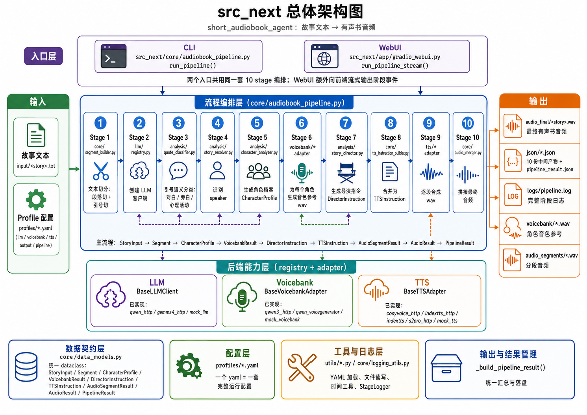

# src_next 总体架构说明

## 1. 文档目的

本文档面向团队成员，介绍 `short_audiobook_agent` 项目重构后的 `src_next/` 新链路。

阅读对象：
- 第一次接触本项目的前端 / 后端 / 算法同事；
- 需要基于本链路做二次开发或维护的开发者；
- 需要在评审 / 排障时快速建立链路全貌认知的同事。

阅读后可以：
- 理解一次"故事文本 → 有声书音频"任务在 `src_next` 中是如何流转的；
- 清楚分层边界、每一层的职责与典型模块；
- 知道配置在哪里、中间产物在哪看、最终输出长什么样；
- 在后续扩展（如新增 TTS 后端、调整分析逻辑）时知道应该改哪一层。

本文档只覆盖整体架构。具体运行命令、模块字段细节请配合阅读姊妹文档 `src_next_主链路运行及核心模块说明.md`。

---

## 2. 整体架构图



**图例说明**：

- 顶部两个入口：CLI（`core/audiobook_pipeline.py:run_pipeline`）和 WebUI（`app/gradio_webui.py`，消费 `run_pipeline_stream`）
- 中部 10 个 stage 由 `core/audiobook_pipeline.py` 编排，按顺序执行
- 各 stage 调用的后端能力（llm / voicebank / tts）通过 registry + adapter 模式注入，profile 切换即换 backend
- 右侧最终产物：`audio_final/<story>.wav`（最终音频）+ `json/*.json`（10 份中间产物 + `pipeline_result.json` 汇总）+ `logs/pipeline.log`（完整 stage 日志）
- 配置层 `profiles/*.yaml` 描述一次完整运行的 5 块组合（llm + voicebank + tts + output + pipeline）

> 图片源文件：`src_next系统架构图.png`（项目根）。若图片无法显示，请确认查看该 Markdown 的环境能访问到项目根的 PNG 文件（GitHub / GitLab / VSCode Markdown 预览均支持相对路径引用）。

---

## 3. src_next 总体链路概览

### 3.1 一次任务的起点和终点

| 维度 | 内容 |
|---|---|
| 起点 | 一个故事 `.txt` 文件 + 一个 profile `.yaml` 文件 |
| 终点 | `<output_root>/<story_name>/audio_final/<story_name>.wav` |
| 同时产出 | `<output_root>/<story_name>/json/*.json`（10 份中间产物）+ `logs/pipeline.log` + `pipeline_result.json` |

### 3.2 一次任务经过的 10 个阶段

按 `src_next/core/audiobook_pipeline.py` 的 stage 注释：

| Stage | 模块 | 主要动作 |
|---|---|---|
| 1/10 | `core/segment_builder.py` | 文本切分：段落切 + 引号切，产出 `list[Segment]` |
| 2/10 | `llm/registry.py` | 根据 profile 创建 LLM 客户端实例 |
| 3/10 | `analysis/quote_classifier.py` | 引号语义分类：对白 / 旁白 / 心理活动 |
| 4/10 | `analysis/story_resolver.py` | 为每个 dialogue segment 识别 speaker |
| 5/10 | `analysis/character_analyzer.py` | 生成角色档案 `list[CharacterProfile]`（含 narrator） |
| 6/10 | `voicebank/*` adapter | 为每个角色生成音色参考 wav |
| 7/10 | `analysis/story_director.py` | 生成导演指令 `list[DirectorInstruction]`（每段一条，11 字段） |
| 8/10 | `core/tts_instruction_builder.py` | 合并 segment + character + director + voice_ref → `list[TTSInstruction]` |
| 9/10 | `tts/*` adapter | 真实合成每段 wav，输出 `list[AudioSegmentResult]` |
| 10/10 | `core/audio_merger.py` | 把分段 wav 按顺序拼成最终 wav |

### 3.3 主入口

| 入口 | 文件 | 入口函数 | 适用场景 |
|---|---|---|---|
| CLI | `src_next/core/audiobook_pipeline.py` | `run_pipeline()`（同步） | 单次跑、脚本批跑、调试 |
| WebUI | `src_next/app/gradio_webui.py` | 调 `run_pipeline_stream()`（生成器） | 黄区多人共用、可视化 |

两个入口**共用同一套 10 stage 编排**，区别仅在 WebUI 版多 yield 阶段事件给前端。两版共享 `_prepare_paths` / `_build_pipeline_result` / `StageLogger` 等 helper，行为完全一致。

---

## 4. 架构分层说明

按真实代码组织，`src_next/` 可理解为以下几层：

### 4.1 入口层（`app/`）
- `app/gradio_webui.py`：Gradio WebUI 启动入口；profile 下拉框自动扫描；事件流消费 `run_pipeline_stream`
- 不含业务逻辑，只做 UI 渲染 + 事件分发

### 4.2 流程编排层（`core/`）
- `core/audiobook_pipeline.py`：**链路核心**。10 个 stage 编排、异常兜底、产物落盘、summary 生成
- `core/data_models.py`：所有 dataclass 的集中定义（数据契约）
- 其他公共组件：
  - `core/segment_builder.py`（stage 1 文本切分）
  - `core/tts_instruction_builder.py`（stage 8 指令合并）
  - `core/audio_merger.py`（stage 10 音频拼接）
  - `core/logging_utils.py`（`StageLogger` 类，统一终端 + 文件 + 内存三合一日志）

### 4.3 分析层（`analysis/`）
- LLM 驱动的语义分析：
  - `analysis/quote_classifier.py`（stage 3）
  - `analysis/story_resolver.py`（stage 4）
  - `analysis/character_analyzer.py`（stage 5）
  - `analysis/story_director.py`（stage 7）
- 这一层**只依赖 `BaseLLMClient` 抽象接口**，不感知具体 LLM 后端

### 4.4 后端能力层（`llm/` + `voicebank/` + `tts/`）
每层都是 **registry + adapter** 模式：

| 子层 | 抽象接口 | 工厂 | 已实现 backend |
|---|---|---|---|
| llm | `BaseLLMClient` | `llm/registry.py:create_llm_client()` | `qwen_http`、`gemma4_http`、`mock_llm` |
| voicebank | `BaseVoicebankAdapter` | `voicebank/registry.py:create_voicebank_adapter()` | `qwen3_http`、`qwen_voicegenerator`（subprocess/WSL）、`mock_voicebank` |
| tts | `BaseTTSAdapter` | `tts/registry.py:create_tts_adapter()` | `cosyvoice_http`、`indextts_http`、`indextts`（subprocess）、`s2pro_http`、`mock_tts`（其余占位） |

切换 backend 只改 profile yaml，core / analysis 层零感知。

### 4.5 配置层（`profiles/`）
- 一个 yaml 文件 = 一次完整运行的所有配置
- 必填 5 块：`llm` / `voicebank` / `tts` / `output` / `pipeline`
- 可选：`webui` 子块（用于 WebUI 下拉框友好显示名）
- `utils/yaml_utils.py:discover_profiles()` 负责 profile 发现 + 校验

### 4.6 工具层（`utils/`）
- `utils/yaml_utils.py`：yaml 加载 + profile 自动发现
- `utils/file_utils.py`：文件读取 / 写入 / 编码 fallback / 安全文件名
- `utils/time_utils.py`：时间戳 + 耗时格式化

### 4.7 输出与结果管理层
- 集中在 `core/audiobook_pipeline.py:_build_pipeline_result()`
- 落盘结构详见第 5 节

---

## 5. 关键数据流

### 5.1 数据契约主线

所有中间产物的 dataclass 都定义在 `core/data_models.py`：

```
StoryInput
  → list[Segment]                         # segment_builder 输出
  → list[Segment]（quote 分类 + speaker 识别）
  → list[CharacterProfile]                # character_analyzer 输出（含 narrator）
  → VoicebankResult                       # voicebank adapter 输出
  → list[DirectorInstruction]             # story_director 输出（每段一条）
  → list[TTSInstruction]                  # tts_instruction_builder 输出（含 voice_ref）
  → list[AudioSegmentResult]              # tts adapter 输出（每段一个 wav）
  → AudioResult                           # audio_merger 输出（最终 wav）
  → PipelineResult                        # pipeline 汇总
```

**关键设计**：`TTSInstruction` 是**模型无关的通用合成指令**，不携带任何 backend 专用字段（如 `indextts_speed` / `cosyvoice_prompt`）。backend 专用参数由各 adapter 内部根据通用字段推断。这是分层的核心保证。

### 5.2 原始文本如何进入链路

1. CLI：`--input input/<story>.txt` 传文件路径
2. WebUI：文本框粘贴 / 上传 txt，WebUI 把内容写到 `<task_dir>/input/<story>.txt` 后调 pipeline
3. pipeline 第 424 行 `Path(input_path).read_text(encoding="utf-8-sig")` 读全文 → 包成 `StoryInput`

### 5.3 处理后的文本结构如何传递

- `Segment` 是最小单元，每个 segment 物理上**只有一个 speaker**
- segment_builder 保证结构上「一个 dialogue segment 一次 LLM 调用」
- 后续 stage 通过 `segment.segment_id` 对齐（`DirectorInstruction.segment_id` / `TTSInstruction.segment_id` 都和 `Segment` 一一对应）

### 5.4 分析结果如何生成

analysis 层 4 个模块各自调 `BaseLLMClient.generate_json()`：
- 输入：segments + 上下文
- 输出：结构化 JSON → 反序列化为 dataclass
- 每个模块都有**严格字段清洗**（枚举白名单 + 范围 clamp）和**细粒度 fallback**（LLM 没覆盖到的 segment 走默认值）

### 5.5 TTS 指令如何生成

`tts_instruction_builder.build_tts_instructions()` 按 4 路输入对齐：
- segment_id → 找 DirectorInstruction
- speaker → 找 CharacterProfile 和 voice_ref（VoicebankResult）
- 全部字段做范围 clamp + 枚举白名单
- 用 `metadata` 字段携带调试信息（如 `has_director_instruction` / `has_voice_ref` / `voice_ref_fallback`）

### 5.6 合成结果如何落盘

每次任务的产物目录结构：

```
<output_root>/<story_name>/
├── input/<story>.txt              # WebUI 模式才会写；CLI 直接用原文件
├── json/
│   ├── segments_raw.json                  # stage 1
│   ├── segments_after_quote_merge.json    # stage 3
│   ├── quote_classifications.json         # stage 3 调试
│   ├── resolved_segments.json             # stage 4
│   ├── characters.json                    # stage 5
│   ├── voicebank_result.json              # stage 6
│   ├── director_plan.json                 # stage 7
│   ├── tts_instructions.json              # stage 8
│   ├── audio_segment_results.json         # stage 9
│   ├── audio_result.json                  # stage 10
│   └── pipeline_result.json               # 最终汇总
├── voicebank/                     # stage 6 wav（每角色一个）
├── audio_segments/                # stage 9 wav（每段一个）
├── audio_final/<story>.wav        # stage 10 最终音频
└── logs/pipeline.log              # 完整 stage 日志（含 ISO 时间戳）
```

### 5.7 中间产物之间的关系

| 文件 | 由哪个 stage 写 | 谁会读它 |
|---|---|---|
| `segments_raw.json` | stage 1 | stage 3 输入 |
| `segments_after_quote_merge.json` | stage 3 | stage 4 输入；`--reuse-existing` 时直接加载跳过 stage 3 |
| `resolved_segments.json` | stage 4 | stage 5/7 输入；reuse 时跳过 stage 4 |
| `characters.json` | stage 5 | stage 6/7/8 输入；reuse 时跳过 stage 5 |
| `voicebank_result.json` | stage 6 | stage 8/9 输入；reuse 时跳过 stage 6 |
| `director_plan.json` | stage 7 | stage 8 输入；reuse 时跳过 stage 7 |
| `tts_instructions.json` | stage 8 | stage 9 输入 |
| `audio_segment_results.json` | stage 9 | stage 10 输入；reuse 时跳过 stage 9 |
| `audio_result.json` | stage 10 | 仅记录 |
| `pipeline_result.json` | 末尾汇总 | 排障首选文件 |

---

## 6. 架构特点

基于代码客观总结（不夸大）：

### 6.1 职责边界清晰
- 每层只依赖下一层的抽象接口，不跨层调用
- core 不知道 LLM / voicebank / TTS 是哪个具体后端
- analysis 不知道 TTS 怎么合成，只产出通用 `DirectorInstruction`

### 6.2 主流程高度集中
- 一次任务的 10 个 stage 全部在 `core/audiobook_pipeline.py` 一个文件里
- 不需要追多个文件才能看懂流程
- 异常兜底 / 产物落盘 / summary 生成都集中在该文件

### 6.3 中间产物可观测性强
- 每个 stage 都落 JSON，可以 `python -m json.tool` 直接看
- `pipeline_result.json` 的 `pipeline_summary.stages` 数组显示每个 stage 的 status / elapsed / mode（run / reused / cached）
- `logs/pipeline.log` 每行带 ISO 时间戳，便于按段排障

### 6.4 配置驱动
- 没有全局 `config/config.yaml`，所有配置在 profile yaml
- 一个 yaml = 一套完整组合（llm + voicebank + tts + output + pipeline）
- 切换 backend / 输出目录 / 流程开关只换 yaml，零代码改动

### 6.5 可维护性
- 每个后端 adapter 文件独立，互不污染
- 加新 backend 不影响其他 backend（registry + 懒导入）
- 数据契约集中在 `core/data_models.py`，改字段时只动一个文件

### 6.6 后续扩展方式（高层；细节见姊妹文档第 8 节）
- **新增 TTS 后端**：`tts/<new>_adapter.py` + registry 一行 + 新 profile yaml
- **新增 LLM 后端**：`llm/<new>_http.py` + registry 一行 + 新 profile yaml
- **新增 voicebank 后端**：同上模式
- **调整分析逻辑**：改 `analysis/<module>.py`（core 不动）
- **调整切分规则**：改 `core/segment_builder.py`（其他层不动）

---

## 7. 需要确认的点

以下信息本文档无法从代码直接确定，需要团队补充：

1. **生产环境实际性能指标**：典型 2000-3000 字故事的 RTF / 总耗时，黄区 cosyvoice_http / s2pro_http / indextts_http 各自的实测数字（建议从历史任务 `pipeline_result.json` 的 `pipeline_summary.rtf` 字段提取）。
2. **黄区各 HTTP 服务的并发上限**：S2Pro / Qwen3 VoiceDesign / Gemma4 LLM 服务器各自能扛多少并发？profile 默认 `max_workers: 4` 是否合理？（需要服务器运维确认）
3. **WebUI 在生产环境的部署形态**：是否走 systemd / supervisor / nohup？端口和并发上限是否需要团队统一规范？
4. **未来路线图**：当前链路已知待完善点（TTS 子进度事件、多说话人拼接、reference_audio 缓存、analysis 层并发）的优先级排期由项目主管确认。
